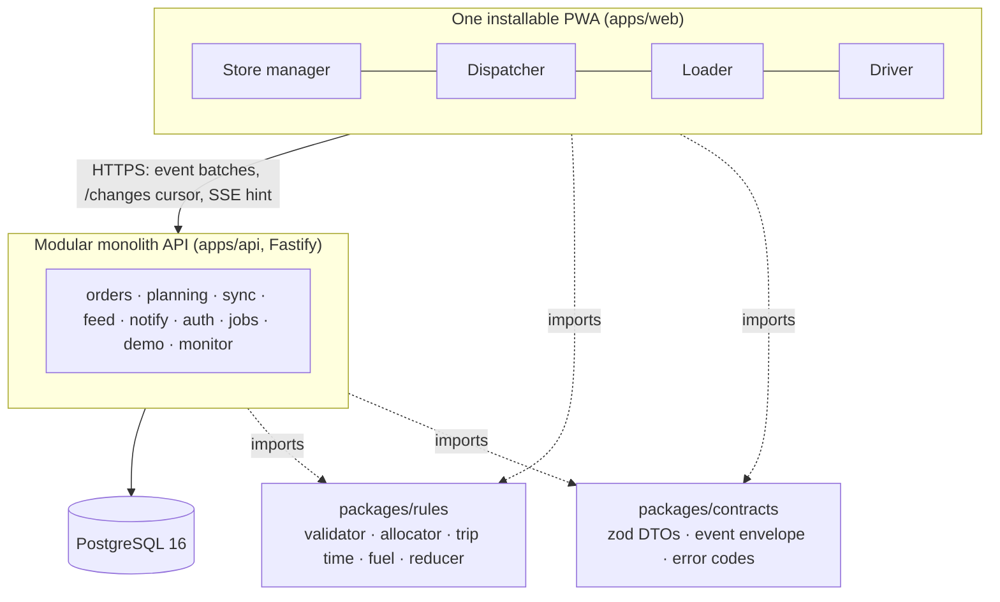

# NextDrop

Delivery planning for Waypoint Group, built by team **GreatSupineProtoplasmicInvertebrateJellies** for the Tech-Triathlon 2026 Hackathon.

NextDrop links ordering, planning, loading, delivery and receipt in one responsive, installable web app. The app has four role shells: store manager, dispatcher, loader and driver. Behind them sit one modular-monolith API and one PostgreSQL database. Every order is one record with a timeline that all four roles read and add to. The dispatcher's published plan is the source every other role works from.

> **Draft.** This README is filled in as features land. Every line marked **TODO** waits on the issue named next to it. Nothing marked TODO works yet.

## Contents

1. [Try it](#try-it)
2. [Seeded accounts](#seeded-accounts)
3. [Judge walkthrough](#judge-walkthrough)
4. [Setup and configuration](#setup-and-configuration)
5. [Significant departures from the Designathon design](#significant-departures-from-the-designathon-design)
6. [Scope: what is not built](#scope-what-is-not-built)
7. [Architecture](#architecture)
8. [Technology stack](#technology-stack)
9. [Repository layout](#repository-layout)
10. [Engineering quality](#engineering-quality)
11. [Architecture decision records](#architecture-decision-records)
12. [Submission documents](#submission-documents)

## Try it

| | |
| --- | --- |
| Public URL | **TODO (#33, #67):** add the public URL once hosting is chosen and the deployment is live. |
| Repository | This monorepo |
| Demo video | Not linked here; submitted through the submission form (#64). |

The public deployment is shared by every judge. A demo reset by one judge is visible to all of them: a banner in every shell names who reset it and when (ADR 0007). For a private copy, run the stack locally with `docker compose up` and open http://localhost:8080 ([Setup](#setup-and-configuration)).

## Seeded accounts

One account per role, as the Booklet requires, created by the seed (`agent-docs/spec/data/seed-and-demo.md` §15.3, ADR 0008, ADR 0027, ADR 0030). The credentials are demo values, not secrets.

| Role | Login | Credential | Who and where |
| --- | --- | --- | --- |
| Store manager | `OUT004` | password `nextdrop-demo` | Dilini, Waypoint Fresh, Colombo, served from Peliyagoda |
| Dispatcher | `nimal@waypoint.test` | password `nextdrop-demo` | Nimal, every depot: choose Peliyagoda or Kandy at sign-in |
| Loader | `LDR001` | PIN `2468` | Kasun, Peliyagoda dock |
| Driver | `DRV039` | PIN `2468` | Sampath, vehicle `VEH039`, Kandy depot, Nuwara Eliya hill run |

Extra accounts, with the same credentials: driver `DRV001` (Ruwan S., `VEH001`, Peliyagoda), loader `LDR002` (Pradeep, Kandy dock) and store manager `OUT104` (Ishara, the hill store on Sampath's trip).

Each login screen has quick-login chips for these four accounts, under "Demo accounts": one click signs in as that role. The chips are part of demo mode and are compiled into the web app when the image is built, so they follow `DEMO_MODE` at build time (`docker compose up --build` after changing it).

## Judge walkthrough

> **TODO (#62):** this numbered walkthrough must match, step for step, the Playwright test in `e2e/`. The test is not written yet, so the steps below are the **planned outline** (`agent-docs/spec/data/seed-and-demo.md` §15.4). Replace each step with the exact clicks once the test passes against the deployed build. Driver and Loader are meant to be judged at phone width.

| # | Role | Step (planned) | Waits on |
| --- | --- | --- | --- |
| 1 | Store | Reset to `before-cutoff`. Sign in at phone width, see the cutoff countdown, place a dry and a chilled order for tomorrow, get confirmation. | #38, #43 |
| 2 | (demo clock) | Move the demo clock past 16:00. Orders close. | #38 |
| 3 | Dispatcher | Open the queue, see demand exceed capacity, **Propose plan**, inspect trips and capacity bars. | #45, #46 |
| 4 | Dispatcher | Try a rule-breaking move (a chilled order onto an ambient truck): blocked, with the reason. Make a valid edit. | #46 |
| 5 | Dispatcher | Review deferrals (reason codes, unavoidable vs choice, outlets skipped yesterday pinned). **Publish**. | #48, #49 |
| 6 | Store | See the deferral notice and the ETA band. | #41, #44 |
| 7 | Loader | Accept the plan, open the trip, load in reverse stop order, flag a shortfall, hold to mark ready. | #52 |
| 8 | Driver | Start the run, deliver a stop with proof of delivery. | #50, #53 |
| 9 | Driver | Switch to force-offline, record two more stops offline (pending count visible). | #40, #53 |
| 10 | Dispatcher | Edit a later stop and cancel a stop the driver already delivered offline. D4 shows the vehicle as no signal. | #61 |
| 11 | Driver | Reconnect: sync progress, plan-changed acknowledgement, a clash card for the cancelled-but-delivered stop. | #47, #54 |
| 12 | Dispatcher | The exceptions inbox shows the clash with the proof-of-delivery photo. Resolve it. | #54, #61 |
| 13 | Store | See delivered (two timestamps), confirm receipt of one order, report a shortage on another. | #44 |
| 14 | Dispatcher | Resolve the dispute, open the capacity outlook. | #59, #55 |

**TODO (#56):** list the reset presets a judge can use to jump to a role's step (`before-cutoff`, `orders-closed`, `plan-published`, `loading`, `mid-run`, `clash-ready`) once they ship.

## Setup and configuration

### Whole stack: `docker compose up`

Prerequisites: Docker with Compose v2 (Docker Desktop, or Docker Engine with the Compose plugin). Nothing else: no Node.js and no `.env` needed.

```bash
docker compose up
```

`docker compose up` builds the app image and starts PostgreSQL 16. The app waits for the database, applies the migrations, seeds the data (when `SEED_ON_START=true`, the default), then serves the API and the PWA together on **http://localhost:8080**. The first build takes a few minutes; later starts take seconds.

- **Health.** `GET /api/readyz` returns OK once the database is reachable and every migration is applied.
- **Stop.** `docker compose down`. Data stays in the `db-data` volume. `docker compose down -v` wipes it, and the next start migrates and seeds a fresh database.
- **Configuration.** Optional. Copy `.env.example` to `.env` and edit it; Compose reads `.env` automatically. Every variable is explained in `.env.example`, and each one has a working default.
- **Session secret.** If `SESSION_SECRET` is empty, the container generates one on first start and keeps it in the `app-data` volume, so sessions survive a restart. Set your own for a public deployment.
- **Profiles.** `--profile public` adds Caddy (automatic HTTPS for `CADDY_DOMAIN`), to be finished by #33. `--profile solver` is a placeholder: the solver is not built (ADR 0014).
- **Several stacks at once** (one per worktree): copy `.env.example` to `.env.local`, set a free `APP_PORT`, then run `docker compose -p wp-<issue> --env-file .env.local up`. The project name keeps containers and volumes apart. The database is never published to the host, so only `APP_PORT` has to differ.

The seed loads the reference data, the seeded accounts, the Peliyagoda peak day and the Kandy story orders (see [Local development](#local-development-works-today)); under Compose it runs on every start. **TODO (#38):** say how to reset the demo day once the demo tools merge.

### Local development (works today)

Prerequisites: Node.js 22 or later, and pnpm 10.28.0 (pinned in `package.json`; `corepack pnpm` works). Integration tests and a running API need PostgreSQL 16.

```bash
pnpm i
```

`pnpm i` installs all workspaces and the git hooks (lefthook).

```bash
pnpm dev
```

`pnpm dev` starts the web app (Vite, port 5173) and the API (Fastify, port 3000). In development, Vite proxies `/api` to the API, so both are served from one origin.

The API reports database and migration readiness at `GET /api/readyz` and liveness at `GET /api/healthz`. To create the schema in a database:

```bash
pnpm --filter @nextdrop/api db:deploy
```

To load the reference data, accounts and the story day into it:

```bash
pnpm --filter @nextdrop/api db:seed
```

The seed is idempotent: a second run writes nothing, and it never rewrites orders the demo has changed (ADR 0030). Set `SEED_ON_START=true` to run it every time the API starts.

Environment variables read by the code today:

| Variable | Used by | Default | Purpose |
| --- | --- | --- | --- |
| `DATABASE_URL` | API, Prisma | none (readiness reports unavailable) | Application database |
| `SHADOW_DATABASE_URL` | Prisma `migrate dev` | none | Separate shadow database for migration development |
| `TEST_DATABASE_URL` | `pnpm test:int` | none (suite skips) | Disposable database whose name ends in `_test` |
| `PORT`, `HOST` | API | `3000`, `0.0.0.0` | Listen address |
| `LOG_LEVEL` | API | `info` | pino log level |
| `NODE_ENV` | API | none | `production` turns off pretty logs, requires `SESSION_SECRET` and makes the session cookie `Secure` |
| `SESSION_SECRET` | API auth | random per start outside production | Signs session cookies and CSRF tokens; at least 32 characters in production |
| `PUBLIC_ORIGIN` | API auth | none | An `https://` origin makes the session cookie `Secure` |
| `FIELD_REAUTH_GRACE_DAYS` | API auth | `30` | Days after expiry that a field device may still re-authenticate with its PIN (ADR 0024) |
| `DEMO_MODE`, `DEMO_SCRIPT_KEY` | API auth | `false`, empty | Demo access; an empty key disables the script-key path (ADR 0024) |
| `SEED_ON_START` | API | `false` | `true` runs the idempotent seed before the API listens; needs `DATABASE_URL` and the files in `data/reference/` |
| `JOBS_ENABLED` | API | `true` | `false` stops the pg-boss planning-day tick (runs every minute) |
| `API_URL`, `API_PORT` | Vite dev proxy | `http://localhost:3000` | Where `/api` is proxied in development |
| `WEB_PORT` | Vite dev server | `5173` | Web dev port |

Compose also reads `APP_PORT`, `POSTGRES_USER`, `POSTGRES_PASSWORD`, `POSTGRES_DB`, `TZ`, `SOLVER_ENABLED`, `SOLVER_URL`, `CADDY_DOMAIN` and `VAPID_*` (see `.env.example`), and sets `WEB_DIST_DIR`, which makes the API serve the built PWA. The demo clock has no variable: its offset is stored in the database and moved with `POST /api/demo/clock` (ADR 0033).

### Checks

| Command | What it runs |
| --- | --- |
| `pnpm typecheck` | `tsc` in every workspace |
| `pnpm lint` | ESLint and Prettier |
| `pnpm test` | Vitest unit and property tests |
| `pnpm test:int` | API integration tests against PostgreSQL (`TEST_DATABASE_URL`) |
| `pnpm build` | Web production build and Prisma client generation |
| `pnpm deps:check` | Module boundaries (dependency-cruiser, `.dependency-cruiser.js`) |
| `pnpm agent:check` | Repository conventions: instruction files, spec headers, banned files |
| `pnpm docs:erd` | Regenerates the ERD in `docs/data-model.md` from the Prisma schema |

CI (`.github/workflows/ci.yml`) runs typecheck, lint, `deps:check`, unit tests, build, and the integration tests against a PostgreSQL 16 service on every PR and push to `main`. A Compose smoke job also runs `docker compose up` with every default and checks `/api/readyz` and the PWA. **TODO (#62):** add `pnpm e2e`.

## Significant departures from the Designathon design

These depart from the Day 5 design as submitted. Each is recorded in an ADR in `agent-docs/adr/` and labelled `designathon-departure`.

1. **Loader phone layout** (ADR 0002). The Loader has a single-column phone layout as well as the tablet design, because judges assess the loader on phone-sized screens.
2. **Sinhala and Tamil fonts** (ADR 0002). Self-hosted Noto Sans Sinhala and Noto Sans Tamil replace the Yaldevi stand-in used in Figma.
3. **Planning interaction** (ADR 0002). Orders are assigned and moved through "Move to…" menus backed by the validator. Drag-and-drop is optional polish.
4. **One walkthrough driver and real IDs** (ADR 0008, picks in ADR 0027). Sampath, on a Kandy reefer truck (`VEH039`) with the low-coverage Nuwara Eliya hill run, is the single walkthrough driver. Ruwan S. stays as a second account. The design's invented IDs (`OUT015`, `VEH001`, `T001`) are replaced by real rows from the reference data: the peak-day store is `OUT004` (no outlet in the data can be identified as Wellawatte), and the hill store is `OUT108`. The dispatcher's "no signal" card and the store's delayed-confirmation view use that same driver and trip.
5. **Presentation and ordering conventions** (ADR 0010):
   - deferrals show the next serviceable date, days unserved and consecutive deferrals;
   - driver and store views group adjacent stops for one outlet into one card;
   - brand ordering guidance is shown as a notice that never blocks an order;
   - capacity is shown in m³ instead of the design's tonnes;
   - timelines are ordered by server insertion, never by device clocks.
6. **Product name** (ADR 0012). The product is NextDrop. Waypoint Group remains the customer and Waypoint Fresh a brand.

**TODO (#22, before submission):** add any departure recorded after this draft. Check merged PRs labelled `designathon-departure` and new ADRs. Open issues already labelled as departures (#36, #46, #52, #61) point to the ADRs above. The dispatcher D4 additions (a "Sync clash" inbox item and an escalated state, #61) are covered by ADR 0008 and need a line here once built.

## Scope: what is not built

Recorded decisions:

- **No SMS.** Notifications are in-app (change feed and SSE hint). Web Push is optional (ADR 0013, #65).
- **No optimisation sidecar.** The greedy allocator in `packages/rules` is the only planning engine (ADR 0014).

> **TODO (#20):** list each tier S item that was not built: authorization matrix test (#58), capacity outlook (#55), remaining demo presets and panel (#56), load reversal (#60), fleet and breakdowns (#63), Sinhala and Tamil strings (#57), Web Push (#65).
>
> **TODO (#57):** native review is pending for Sinhala and Tamil strings. Every leaf in `apps/web/src/i18n/locales/{si,ta}/shared/ui.json` and the development gallery's `apps/web/src/ui/gallery/locales/{si,ta}.json` is marked `draft`; these translations are not yet native-reviewed. Existing login locale review states remain in their own files.

The shared component gallery is available at `/dev/ui` when running the Vite development server. It includes all four role themes and English, Sinhala and Tamil controls. Its route, sample text and component chunk are excluded from production builds.

## Architecture



Key ideas:

- **One implementation of every rule.** Every planning path goes through `packages/rules`. The browser bundles it for instant feedback, and the server re-validates every plan.
- **Orders are event-logged.** `order_events` is append-only. Order status is a projection computed by one pure reducer.
- **Field work is intent events.** Loader and driver actions are queued on the device, ingested idempotently and reconciled by explicit rules.
- **Clashes use plan versions, not device clocks.** Nothing is auto-resolved when a driver's fact contradicts a plan change.
- **The server owns time.** Cutoffs, countdowns and ETAs use the server clock (with a demo override). Times are stored in UTC and shown in Asia/Colombo.

More in [docs/architecture.md](docs/architecture.md) (diagram, modules, dependency rules, build status) and [docs/data-model.md](docs/data-model.md) (ERD).

## Technology stack

In use today:

| Concern | Choice |
| --- | --- |
| Language and monorepo | TypeScript (strict), pnpm workspaces, Node.js 22 |
| Web | Vite, React 19, React Router, TanStack Query, Tailwind CSS 4 |
| API | Fastify 5, `fastify-type-provider-zod`, pino |
| Data | PostgreSQL 16, Prisma 7 with the `pg` driver adapter; hand-written SQL in migrations for triggers, CHECKs and partial indexes |
| Contracts | zod 4 schemas in `packages/contracts`, shared by web and API |
| Tests | Vitest, fast-check (property tests), integration tests against PostgreSQL |
| Quality | ESLint, Prettier, lefthook git hooks |

Planned by the spec (`agent-docs/spec/platform/stack-and-layout.md` §3.1) and added with the features that need them: `vite-plugin-pwa` (Workbox), Dexie.js, react-i18next, shadcn/ui, pg-boss, Luxon, argon2, Playwright and axe. **TODO (before submission):** move each into the table above once it is used.

## Repository layout

```
apps/
  web/            Vite PWA: login and four role shells (src/roles/{store,dispatcher,loader,driver})
  api/            Fastify API; prisma/ holds the schema, migrations and story-fixture seed script
packages/
  rules/          pure TypeScript rules core, no runtime dependencies
  contracts/      zod DTOs, event envelope and catalogue, error codes, status vocabulary
  config/         shared tsconfig, ESLint and Prettier presets
e2e/              Playwright walkthrough (TODO #62)
data/reference/   approved reference CSVs used for seeding (ADR 0011)
docs/             submission documents: architecture, data model, AI disclosure
agent-docs/       Booklet copy, spec, ADRs, design notes and process docs
```

## Engineering quality

- **Rules core tests.** The rules core has unit tests for the validator codes. They include the Booklet's worked trip-time examples (101 and 112 minutes, and 213 of 270), the trip time, ETA, fuel and priority rules, and the order reducer. Property tests (fast-check) check that every proposed plan passes the validator and that the allocator is deterministic.
- **Contracts.** One zod schema registry and a typed route table, shared by web and API (ADR 0024).
- **Authorization.** Every API route declares a policy action from the contracts route table; a route without one cannot be registered. `can()` and `scoped()` deny by default (ADR 0028).
- **Database.** Hand-written SQL migrations add immutability triggers, CHECK constraints and a partial unique index. Integration tests run against real PostgreSQL in an isolated schema per run (ADR 0023).
- **Boundaries.** `apps/web` and `apps/api` never import each other, `apps/web` never imports Prisma, and API modules talk only through each module's `index.ts`. Rules live only in `packages/rules`. dependency-cruiser enforces this in CI and in the pre-push hook.
- **CI.** Every PR and push to `main` runs typecheck, lint, boundaries, unit and property tests, integration tests against PostgreSQL 16, and the build.
- **Process.** Git hooks run formatting, lint, typecheck, boundaries and tests. Every change goes through an issue, a plan comment and a PR with an AI assistance section. Lasting decisions become ADRs.

## Architecture decision records

All in [`agent-docs/adr/`](agent-docs/adr/). "D" marks a Designathon departure.

| ADR | Decision |
| --- | --- |
| 0001 | Agent context system |
| 0002 D | Known departures from the Designathon design |
| 0003 | Window check for the second Fresh trip |
| 0004 | Loaded orders and later plan changes |
| 0005 | Resolving a shortfall at the dock |
| 0006 | Lock scope for the weekly fuel quota |
| 0007 | Demo reset epoch and visible actor |
| 0008 D | Story fixtures and the walkthrough driver |
| 0009 | Priority order and "least impact" |
| 0010 D | Presentation and ordering conventions |
| 0011 | Reference data may be published |
| 0012 D | Product name is NextDrop |
| 0013 | No SMS; Web Push optional |
| 0014 | Optimisation sidecar deferred |
| 0015 | The live Figma file is the design source of truth |
| 0016 | Repository personas over the Figma persona page |
| 0017 | Vehicle breakdowns |
| 0018 | Rules core calendar fallback, integer fuel units and ordering guidance |
| 0019 | Trip departure takes planned orders out; accepted held facts override the table |
| 0020 | Trip departure times, trip end and the store ETA band |
| 0021 | Validator code details |
| 0022 | Allocator ranking classes, placement order and local search |
| 0023 | Database foundation, active assignments and raw SQL migration ownership |
| 0024 | API wire contracts and client sync envelopes |
| 0025 | Store the full planning-day lifecycle |
| 0026 | Short-resolution and load-reversal routes |
| 0027 D | Story fixture picks from the reference CSVs (under ADR 0008) |
| 0028 | Auth session, lockout and policy details |

## Submission documents

- [docs/architecture.md](docs/architecture.md): architecture diagram and module boundaries
- [docs/data-model.md](docs/data-model.md): data model (ERD)
- [docs/ai-disclosure.md](docs/ai-disclosure.md): AI tool disclosure

Data notice: `data/reference/` holds only the shared general reference files the owner approved for publication (ADR 0011). Orders and history are synthetic. Training and Test files are not in this repository.
