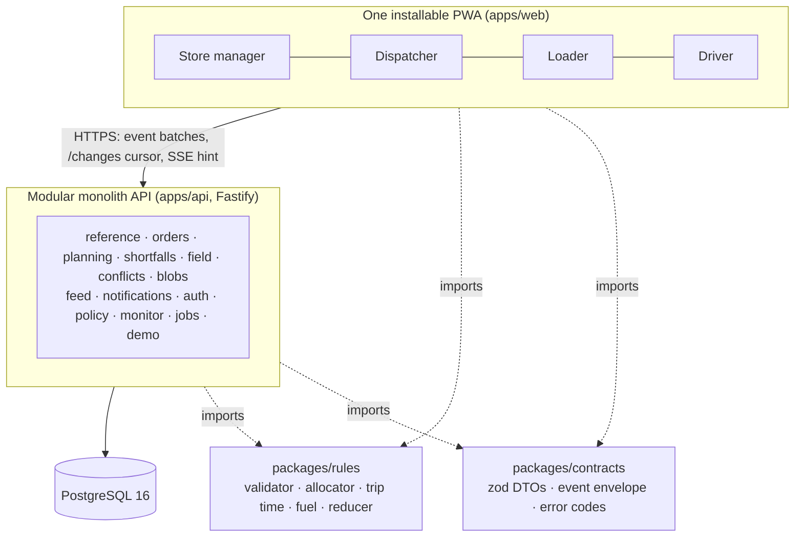

# NextDrop

Delivery planning for Waypoint Group, built by team **GreatSupineProtoplasmicInvertebrateJellies** for the Tech-Triathlon 2026 Hackathon.

NextDrop links ordering, planning, loading, delivery and receipt in one responsive, installable web app. The app has four role shells: store manager, dispatcher, loader and driver. Behind them sit one modular-monolith API and one PostgreSQL database. Every order is one record with a timeline that all four roles read and add to. The dispatcher's published plan is the source every other role works from.

## Contents

1. [Try it](#try-it)
2. [Seeded accounts](#seeded-accounts)
3. [Judge walkthrough](#judge-walkthrough)
4. [Setup and configuration](#setup-and-configuration)
5. [Significant departures from the Designathon design](#significant-departures-from-the-designathon-design)
6. [Scope: what is not built](#scope-what-is-not-built)
7. [Architecture](#architecture)
8. [Technology stack](#technology-stack)
9. [Repository layout](#repository-layout)
10. [Engineering quality](#engineering-quality)
11. [Architecture decision records](#architecture-decision-records)
12. [Submission documents](#submission-documents)

## Try it

| | |
| --- | --- |
| Public URL | https://nextdrop.duckdns.org (a DigitalOcean droplet, ADR 0051) |
| Repository | This monorepo |
| Demo video | Not linked here; submitted through the submission form (#64). |

The public deployment is shared by every judge. A demo reset by one judge is visible to all of them: a banner in every shell names who reset it and when (ADR 0007). For a private copy, run the stack locally with `docker compose up` and open http://localhost:8080 ([Setup](#setup-and-configuration)).

## Seeded accounts

One account per role, as the Booklet requires, created by the seed (`agent-docs/spec/data/seed-and-demo.md` §15.3, ADR 0008, ADR 0027, ADR 0030). The credentials are demo values, not secrets.

| Role | Login | Credential | Who and where |
| --- | --- | --- | --- |
| Store manager | `OUT004` | password `nextdrop-demo` | Dilini, Waypoint Fresh, Colombo, served from Peliyagoda |
| Dispatcher | `nimal@waypoint.test` | password `nextdrop-demo` | Nimal, every depot: choose Peliyagoda or Kandy at sign-in |
| Loader | `LDR001` | PIN `2468` | Kasun, Peliyagoda dock |
| Driver | `DRV039` | PIN `2468` | Sampath, vehicle `VEH039`, Kandy depot, Nuwara Eliya hill run |

Extra accounts, with the same credentials: driver `DRV001` (Ruwan S., `VEH001`, Peliyagoda), loader `LDR002` (Pradeep, Kandy dock) and store manager `OUT104` (Ishara, the hill store on Sampath's trip).

Each login screen has quick-login chips for these four accounts, under "Demo accounts": one click signs in as that role. The chips are part of demo mode and are compiled into the web app when the image is built, so they follow `DEMO_MODE` at build time (`docker compose up --build` after changing it).

## Judge walkthrough

These fourteen steps are the steps `e2e/tests/walkthrough.spec.ts` runs, in the same order and with the same titles as `agent-docs/spec/data/seed-and-demo.md` §15.4. Change the test and this list together.

Use a phone-width window for the Store (steps 1 and 6), the hill Store (step 13) and the Driver. The Loader is judged at phone width and at tablet width: the Playwright suite runs the walkthrough twice, once at each Loader width, and the Driver goes offline with the in-app switch in one run and with the browser's offline mode in the other. The Dispatcher uses a desktop window. Sign in with the accounts above, or with the **Demo accounts** chips.

The public site is shared. A reset is visible to every judge, and the banner in each shell names who reset it and when. The droplet also resets the demo every hour to `orders-closed` by default (ADR 0055), so for the full fourteen steps start with an explicit `before-cutoff` reset below. For a private copy, use `http://localhost:8080` after `docker compose up`.

There is no clock or reset control in the app yet (#56). The test moves the server clock through the API, and so does a judge. Presets that work today are `before-cutoff` and `orders-closed`. `plan-published`, `loading`, `mid-run` and `clash-ready` answer 409. The walkthrough starts at `before-cutoff` and moves the clock forward. `orders-closed` is the same reset plus Dilini's two orders and the cutoff, if you want to begin at step 3.

Clock moves below are Asia/Colombo wall times. The API accepts UTC instants ending in `Z` only.

```bash
BASE=http://localhost:8080   # or https://nextdrop.duckdns.org

# Prints JSON including "csrfToken". Copy that value into CSRF.
curl -sS -c /tmp/nd-cookies -H 'x-nextdrop-csrf: 1' -H 'content-type: application/json' \
  -d '{"role":"DISPATCHER","email":"nimal@waypoint.test","password":"nextdrop-demo","depot":"Peliyagoda"}' \
  "$BASE/api/auth/login"
CSRF=paste-the-csrfToken-here

# Restore the seeded day. The clock becomes Mon 28 Sep 2026 14:00.
curl -sS -b /tmp/nd-cookies -H "x-nextdrop-csrf: $CSRF" -H 'content-type: application/json' \
  -d '{"preset":"before-cutoff"}' "$BASE/api/demo/reset"

# Move the clock, then apply time-driven transitions (orders close at 16:00).
# The argument is a UTC instant, for example 2026-09-28T10:35:00.000Z (Mon 28 Sep 16:05).
clock() {
  curl -sS -b /tmp/nd-cookies -H "x-nextdrop-csrf: $CSRF" -H 'content-type: application/json' \
    -d "{\"serverTime\":\"$1\"}" "$BASE/api/demo/clock"
  curl -sS -b /tmp/nd-cookies -H "x-nextdrop-csrf: $CSRF" -X POST "$BASE/api/demo/tick"
}
```

Reset and clock are limited to 10 calls a minute. Keep the Dispatcher browser signed in; the cookie above is a second session for the clock only.

1. **Reset to `before-cutoff`. Store: sign in on a phone-width window, see the cutoff countdown (server time), place a dry and a chilled order for tomorrow; receive confirmation.** Open `/login/store` and sign in as `OUT004`. The home banner says **Tue 29 Sep order** and **closes in 1 h 5x min**. Open **Place order**. **Tue 29 Sep** is selected, and the page says **Tue 29 Sep closes 16:00** and **1 h 5x min left**. Open **Add items from the catalogue**. On **Rice, 25 kg bag**, press **+** (the button's accessible name is **Increase quantity**). Open the **Chilled** tab and do the same for **Fresh milk, crate of 12**. Press **Done · 1 item in chilled order**, then **Review 2 orders · 2 units**, then **Submit 2 orders**. The confirmation is **2 orders placed**, **Delivery Tue 29 Sep**, with one **Dry · ORD…** heading and one **Chilled · ORD…** heading. Note both IDs: step 4 moves them.

2. **Advance the demo clock past 16:00. Orders close.** `clock 2026-09-28T10:35:00.000Z` (Mon 28 Sep 16:05). On the store phone, open `/store/order`. **Tue Closed** is disabled, **Wed 30 Sep** is selected, and the page says **Wed 30 Sep closes 16:00**.

3. **Dispatcher: open the queue; see demand exceed capacity; Propose plan; inspect trips and capacity bars.** Open `/login/dispatch` and sign in as `nimal@waypoint.test`. The workspace opens on **Peliyagoda**. Open **Order queue**. It says **Planning deliveries for Tue 29 Sep · Peliyagoda**, **88** orders (**Fresh 66 · Style 13 · Tech 9**), and **Van-only orders** **6** against **2 available vans**. Press **Propose plan** and wait for **Draft saved**. Open **Plan board**. The summary is **82 of 88 orders planned · 6 unassigned**, with a heading **Unassigned · 6**. The first trip is **T001 · Trip 1 of 2**, with meters **Weight**, **Volume**, **Time budget** and **Weekly fuel used**.

4. **Attempt a rule-breaking move (e.g. chilled order onto an ambient truck): blocked with the reason. Make a valid edit.** On the plan board, find the first trip labelled **Ambient · Fresh** and note its trip id. On the chilled order from step 1, open **Move to…** and choose that trip. The review panel says **Chilled orders need a reefer**, and **Save changes** stays disabled. Press **Cancel**. On the dry order, open **Move to…** and choose **Unassigned**. The panel says **Constraints pass** with warnings to review, and **Save changes** is enabled. Save. The board becomes **81 of 88 orders planned · 7 unassigned**.

5. **Review deferrals: reason codes pre-filled with unavoidable vs choice; outlets skipped yesterday pinned. Publish.** Open **Review deferrals & publish**. The page is **Defer & publish**. **Previously deferred · prioritised first** shows those outlets now planned and **0 deferred again**. Six rows read **Unavoidable · available pool exhausted**, each with a reason already chosen and the status **Ready**. The dry order from step 4 reads **Choice · a feasible slot existed**, reason **Other**. **Publish plan** is disabled and the panel says **6 of 7 reasons set**. Type `Store agreed to take the dry order with Wednesday's run` in that row's note. The panel says **7 of 7 reasons set**. Press **Publish plan**. The history line reads **Version 1 · 81 served · 7 deferred**. Switch **Depot** to **Kandy**, open **Plan board**, and press **Propose plan**. Kandy shows **8 of 8 orders planned · 0 unassigned**. Open **Review deferrals & publish**. It says **Every order is assigned to a trip.** Press **Publish plan**. The history line reads **Version 1 · 8 served · 0 deferred**.

6. **Store: receives the deferral notice and ETA band.** On the store phone, open `/store`. Open **Notifications, 2 unread**. One line says the dry order was deferred, and one says there is a new ETA for the chilled order. Close the dialog. **My deliveries** lists the chilled order as **Planned** and the dry order as **Moved to Wed 30 Sep** and **Deferred**. Press **View deferral notice**. The timeline shows **Moved to Wed 30 Sep** and a **Reason** that names Wed 30 Sep and the original due day. Open **Order tracking**. It says **Next delivery · Tue 29 Sep**, shows an ETA window, and names the chilled order's trip and stop.

7. **Loader (phone and tablet widths): accept the plan; open the trip; load in reverse stop order; flag a shortfall; hold-to-mark ready.** The automated step is `test.fixme`. The Loader asks someone to accept a plan only when a *changed* plan reaches a phone that already has one. The first published plan does not. The suite therefore does the rest of this step at the start of step 8, at phone width in one run and tablet width in the other. Do that loading before **Start run**, as step 8 describes. There is no separate **Accept plan** on this first plan.

8. **Driver: start the run; deliver a stop with proof of delivery.** `clock 2026-09-28T21:15:00.000Z` (Tue 29 Sep 02:45). Sign in as `LDR002` at phone or tablet width. **Dock trips** lists the hill trip. Open it. The heading is **Load in this order — last stop first**, and the trip is **Nuwara Eliya · Trip 1**. The load order is **OUT107 · Stop 5**, **OUT106 · Stop 4**, **OUT104 · Stop 3**, **OUT104 · Stop 2**, **OUT105 · Stop 1**. Eleven lines. On **Biscuits, case of 36**, press **Short**, then **Out of stock**, then **Save report for dispatcher**. The line shows **1 short**. On every other line, press **Loaded** until it says **Checked**. The page shows **5 of 5 checked**. Open **Review & mark ready**. The biscuits line says **Waiting on dispatcher**, and **Hold to mark ready** is disabled. On the dispatcher window (still Kandy), open **Delivery Progress**, then the **Shortfalls** tab, and open **Short 1 of Biscuits, case of 36**. **Ship partial** is already selected. Press **Confirm decision**. The loader's line becomes **Ship partial · approved**, and the hold button enables. Press and hold **Hold to mark ready** for about two seconds, until **Handed over to driver**. Then `clock 2026-09-28T21:55:00.000Z` (Tue 29 Sep 03:25). Sign in as `DRV039` at phone width. The run shows **VEH039 · Truck**, **Trip T… · Fresh · Kandy · 03:30** and **0/4**. Press **Start run**. Press **Go to stop 1**. The stop is **OUT105**. Press **Arrived**, then **Delivered in full**. On **Proof · Stop 1**, fill **Received by / contact name** with `Nadeesha`, draw on **Sign here**, and press **Save delivery**. **Saved on this phone** appears. Press **Continue the run**. The run shows **1/4** and a line **Delivered … · confirmed … after sync**.

9. **Switch the driver to force-offline; record two more stops offline (pending count visible).** Open **Settings**, turn on **Simulate offline**, and go **Back to run**. (The other Playwright run uses the browser's offline mode instead of the switch.) Deliver stop 2 (**OUT104**) twice, once per order, then stop 3 (**OUT106**), the same way as stop 1: **Go to stop**, **Arrived**, **Delivered in full**, the name `Nadeesha`, a signature, **Save delivery**, **Continue the run**. The run shows **Offline — 3 deliveries saved on this phone** and **3/4**.

10. **Dispatcher edits a later stop and cancels a stop the driver already delivered offline. D4 shows the vehicle as no signal / last heard.** `clock 2026-09-28T22:15:00.000Z` (Tue 29 Sep 03:45). On the dispatcher plan board for Kandy, the **VEH039** trip says **Departs 03:30 · 5 stops**. **Move to…** on **ORD10490** (stop 1, already confirmed) is disabled. Open **Move to…** on **ORD10491** and choose **Unassigned**. The review says **All available checks pass**. Save. The board shows **7 of 8 orders planned · 1 unassigned**, and **OUT107** is now stop 4. Open **Review deferrals & publish**. On the **ORD10491** row, type `Store asked to take this order with Wednesday's run`. The panel says **1 of 1 reasons set**. Press **Publish plan**. The history line reads **Version 2 · 7 served · 1 deferred**. Open **Delivery Progress**. The **VEH039** card says **No signal**, **Last heard 03:2x · … min ago · stop 1 of 4**, and **Records sync when signal returns. Not late, just out of signal.**

11. **Driver reconnects: sync progress, plan-changed acknowledgement, and a clash card for the cancelled-but-delivered stop.** On the driver's phone, open **Settings**, turn **Simulate offline** off, and go **Back to run**. Open **Needs dispatch**. Press **Sync now** if it is shown, and wait until the heading is **All synced** (the proof image can take a minute). A status says **Clash — both records kept** and names **OUT106**. **Your record** says **Delivered in full**, with **Captured … on phone**, **Received … by server**, and the saved proof image. **Dispatch change** says **Stop deferred** and **Plan 1 → 2**, and the page says **Sent to dispatch's exceptions inbox**. Open **Your run changed** (or press **Review plan**). It asks you to review the stops on plan 2, and lists **4 · OUT107 · Nuwara Eliya**. Press **Got it**, then **OK, back to run**. The run shows **2/3** and **ORD10412 · Delivered … · confirmed … after sync**.

12. **Dispatcher exceptions inbox shows the clash with the POD photo; resolve it.** Reload **Delivery Progress** so the proof image is on the page (an evidence panel opened before the upload finished keeps saying it has no photo). Open the **Sync clashes 3** tab and the first **ORD10491 · OUT106** row. The panel **Sync clash · ORD10491** names **OUT106 Waypoint Fresh, Nuwara Eliya · T043 · VEH039 · chilled**, says **Delivered offline, but the stop was cancelled**, and shows **Driver proof of delivery 1**. Press **Accept fact**. Repeat for the other two rows of the same order, until the tab reads **Sync clashes 0**. A status says **Delivery fact accepted for ORD10491**.

13. **Store: sees delivered (double timestamp), confirms receipt of one order, reports a shortage on another.** Sign in as `OUT104` (Ishara) at phone width. The card says **Trip T043 · you are stop 2**, **Delivered … on the driver's phone** and **Confirmed … after sync**. Press **Confirm delivery**. **Confirm receipt** shows **ORD10412 · Chilled**, **Pre-filled from the driver's record** and **Signed by Nadeesha**. The received quantities are **8** for eggs and **12** for fresh milk. Press **Received as delivered**. The timeline shows **20 units received** and **8 ordered · 8 delivered · 8 received**. Go back to `/store` and open **Dry · ORD10468**. Press **Report an issue**, choose **Short**, and set **Item** to **Tea, case of 24 × 400 g · case**. **How many** is **1**, of **6 delivered**. Press **Send to dispatcher**. The timeline shows **Disputed**.

14. **Dispatcher resolves the dispute; opens the capacity outlook.** On **Delivery Progress**, open the **Disputes 1** tab and **ORD10468 · OUT104**. The panel **Reported issue · ORD10468** says **Disputed** and **Short delivery**, and shows the driver's proof image beside both delivery times. Press **Credit**. A status says **Credit recorded for ORD10468**, and the tab reads **Disputes 0**. Open **Capacity outlook**. The page shows the weekly demand chart in m³ against fleet capacity, and the table **Weekly demand and capacity (m³)** with at least twelve week rows.

**Repeat deferral (D3).** This is a separate scenario (`e2e/tests/repeat-deferral.spec.ts`), not one of the fourteen steps. Reset to `before-cutoff` and advance the clock past 16:00 (`clock 2026-09-28T10:35:00.000Z`). Sign in as the dispatcher on the Kandy depot and **Propose plan** for Tue 29 Sep. Take **ORD10412** (carried over from Monday) off its trip. Review deferrals shows it pinned as **Deferred again** and asks for a justification; **Publish** stays blocked until you write one. The automated screen assertion for that pin is still `test.fixme`; the API test in the same file already checks that publishing without the note is refused and publishing with a note succeeds. Reset to `before-cutoff` to return to the standard walkthrough.

## Setup and configuration

### Whole stack: `docker compose up`

Prerequisites: Docker with Compose v2 (Docker Desktop, or Docker Engine with the Compose plugin). Nothing else: no Node.js and no `.env` needed.

```bash
docker compose up
```

`docker compose up` builds the app image and starts PostgreSQL 16. The app waits for the database, applies the migrations, seeds the data (when `SEED_ON_START=true`, the default), then serves the API and the PWA together on **http://localhost:8080**. The first build takes a few minutes; later starts take seconds.

- **Health.** `GET /api/readyz` returns OK once the database is reachable and every migration is applied.
- **Stop.** `docker compose down`. Data stays in the `db-data` volume. `docker compose down -v` wipes it, and the next start migrates and seeds a fresh database.
- **Configuration.** Optional. Copy `.env.example` to `.env` and edit it; Compose reads `.env` automatically. Every variable is explained in `.env.example`, and each one has a working default.
- **Session secret.** If `SESSION_SECRET` is empty, the container generates one on first start and keeps it in the `app-data` volume, so sessions survive a restart. Set your own for a public deployment.
- **Profiles.** `--profile public`, or `COMPOSE_PROFILES=public` in `.env`, adds Caddy: it gets an HTTPS certificate for `CADDY_DOMAIN` automatically ([Public deployment](#public-deployment)). `--profile solver` is a placeholder: the solver is not built (ADR 0014).
- **Several stacks at once** (one per worktree): copy `.env.example` to `.env.local`, set a free `APP_PORT`, then run `docker compose -p wp-<issue> --env-file .env.local up`. The project name keeps containers and volumes apart. The database is never published to the host, so only `APP_PORT` has to differ.

The seed loads the reference data, the seeded accounts, the Peliyagoda peak day and the Kandy story orders (see [Local development](#local-development-works-today)); under Compose it runs on every start. To start again from a clean seeded day, run `docker compose down -v` and then `docker compose up`. With `DEMO_MODE=true` (the Compose default) the API also has a demo clock and a reset for a signed-in Dispatcher (`POST /api/demo/clock`, `POST /api/demo/tick`, `POST /api/demo/reset`, ADR 0033). The [walkthrough](#judge-walkthrough) shows the calls. The in-app demo panel is not built (#56).

### Local development (works today)

Prerequisites: Node.js 22 or later, and pnpm 10.28.0 (pinned in `package.json`; `corepack pnpm` works). Integration tests and a running API need PostgreSQL 16.

```bash
pnpm i
```

`pnpm i` installs all workspaces and the git hooks (lefthook).

```bash
pnpm dev
```

`pnpm dev` starts the web app (Vite, port 5173) and the API (Fastify, port 3000). In development, Vite proxies `/api` to the API, so both are served from one origin.

The API reports database and migration readiness at `GET /api/readyz` and liveness at `GET /api/healthz`. To create the schema in a database:

```bash
pnpm --filter @nextdrop/api db:deploy
```

To load the reference data, accounts and the story day into it:

```bash
pnpm --filter @nextdrop/api db:seed
```

The seed is idempotent: a second run writes nothing, and it never rewrites orders the demo has changed (ADR 0030). Set `SEED_ON_START=true` to run it every time the API starts.

Environment variables read by the code today:

| Variable | Used by | Default | Purpose |
| --- | --- | --- | --- |
| `DATABASE_URL` | API, Prisma | none (readiness reports unavailable) | Application database |
| `SHADOW_DATABASE_URL` | Prisma `migrate dev` | none | Separate shadow database for migration development |
| `TEST_DATABASE_URL` | `pnpm test:int` | none (suite skips) | Disposable database whose name ends in `_test` |
| `PORT`, `HOST` | API | `3000`, `0.0.0.0` | Listen address |
| `LOG_LEVEL` | API | `info` | pino log level |
| `NODE_ENV` | API | none | `production` turns off pretty logs, requires `SESSION_SECRET` and makes the session cookie `Secure` |
| `SESSION_SECRET` | API auth | random per start outside production | Signs session cookies and CSRF tokens; at least 32 characters in production |
| `PUBLIC_ORIGIN` | API auth | none | An `https://` origin makes the session cookie `Secure` |
| `FIELD_REAUTH_GRACE_DAYS` | API auth | `30` | Days after expiry that a field device may still re-authenticate with its PIN (ADR 0024) |
| `DEMO_MODE`, `DEMO_SCRIPT_KEY` | API auth | `false`, empty | Demo access; an empty key disables the script-key path (ADR 0024) |
| `SEED_ON_START` | API | `false` | `true` runs the idempotent seed before the API listens; needs `DATABASE_URL` and the files in `data/reference/` |
| `JOBS_ENABLED` | API | `true` | `false` stops the pg-boss planning-day tick (runs every minute) |
| `API_URL`, `API_PORT` | Vite dev proxy | `http://localhost:3000` | Where `/api` is proxied in development |
| `WEB_PORT` | Vite dev server | `5173` | Web dev port |

Compose also reads `APP_PORT`, `POSTGRES_USER`, `POSTGRES_PASSWORD`, `POSTGRES_DB`, `TZ`, `SOLVER_ENABLED`, `SOLVER_URL`, `CADDY_DOMAIN`, `COMPOSE_PROFILES` and `VAPID_*` (see `.env.example`), and sets `WEB_DIST_DIR`, which makes the API serve the built PWA. The demo clock has no variable: its offset is stored in the database and moved with `POST /api/demo/clock` (ADR 0033).

### Public deployment

The public URL runs the same Compose stack on one DigitalOcean droplet, with Caddy in front (ADR 0051):

- **Droplet:** 2 GB RAM, 1 shared vCPU, SGP1, Ubuntu 24.04.
- **Hostname:** `nextdrop.duckdns.org`, a free DuckDNS name pointing at the Reserved IP `137.184.250.211`. Caddy gets a Let's Encrypt certificate for it.
- **Firewall:** a DigitalOcean Cloud Firewall allows only ports 22, 80 and 443. Docker bypasses `ufw`, and `app` publishes 8080.

To set up a new droplet, paste [`docker/droplet-init.sh`](docker/droplet-init.sh) into **User data** when you create it. The script:

1. adds swap;
2. installs Docker;
3. clones this repository to `/opt/nextdrop`;
4. writes `.env` with `COMPOSE_PROFILES=public`, the hostname, generated secrets and `DEMO_MODE=true`. The hostname is `DOMAIN` from the top of the script, or `<ip>.sslip.io` when `DOMAIN` is empty;
5. runs `docker/redeploy.sh`, which starts the stack, installs the hourly demo reset and resets the demo.

To redeploy, run this over SSH:

```bash
/opt/nextdrop/docker/redeploy.sh
```

It pulls, rebuilds and restarts the stack, installs the hourly reset, then resets the demo with [`docker/reset-demo.sh`](docker/reset-demo.sh) (ADR 0054, ADR 0055). A failed build stops the script before the reset, and the old container keeps serving.

The demo clock keeps running after a reset, so a cron job resets the demo every hour, on the hour (`/etc/cron.d/nextdrop-demo-reset`, log in `/var/log/nextdrop-demo-reset.log`). Whenever judges arrive, the public demo is within an hour of the seeded story day: by default the `orders-closed` preset, Mon 28 Sep 2026 16:05 on the demo clock, with the Peliyagoda peak day and the Kandy story orders closed for Tue 29 Sep and ready to plan. A reset on the hour also discards whatever a judge was doing, and every shell shows the reset banner.

- To reset now: `docker/reset-demo.sh`, or `docker/reset-demo.sh before-cutoff` for another preset.
- To change the preset for deploys and the hourly job, set `DEMO_DEPLOY_PRESET` in `.env`. A preset that is not built yet fails with a 409.
- To stop the hourly reset, set `DEMO_RESET_HOURLY=false` in `.env` and redeploy, or run `docker/reset-demo.sh --remove-cron`.
- To deploy without touching the demo state, pass `--keep`.
- A plain restart, such as a reboot, never resets: the seed keeps the demo progress (ADR 0030).

Other tasks on the droplet:

| Task | Command |
| --- | --- |
| Follow the logs | `docker compose logs -f --tail=200 app` |
| Check health | `curl https://nextdrop.duckdns.org/api/readyz` |
| Back up the database | `docker compose exec -T db pg_dump -U nextdrop nextdrop \| gzip > ~/nextdrop-$(date +%F-%H%M).sql.gz` |

### Checks

| Command | What it runs |
| --- | --- |
| `pnpm typecheck` | `tsc` in every workspace |
| `pnpm lint` | ESLint and Prettier |
| `pnpm test` | Vitest unit and property tests |
| `pnpm test:int` | API integration tests against PostgreSQL (`TEST_DATABASE_URL`) |
| `pnpm build` | Web production build and Prisma client generation |
| `pnpm deps:check` | Module boundaries (dependency-cruiser, `.dependency-cruiser.js`) |
| `pnpm agent:check` | Repository conventions: instruction files, spec headers, banned files |
| `pnpm docs:erd` | Regenerates the ERD in `docs/data-model.md` from the Prisma schema |

CI (`.github/workflows/ci.yml`) runs typecheck, lint, `deps:check`, unit tests, build, and the integration tests against a PostgreSQL 16 service on every PR and push to `main`. A Compose smoke job also runs `docker compose up` with every default, checks `/api/readyz` and the PWA, then runs `pnpm e2e` (the walkthrough twice, plus the axe smoke checks) against that stack. `pnpm e2e` locally needs the stack already up and, once, `pnpm e2e:install`. See [e2e/README.md](e2e/README.md).

## Significant departures from the Designathon design

These depart from the Day 5 design as submitted. Each is recorded in an ADR in `agent-docs/adr/` and labelled `designathon-departure`.

1. **Loader phone layout** (ADR 0002). The Loader has a single-column phone layout as well as the tablet design, because judges assess the loader on phone-sized screens.
2. **Sinhala and Tamil fonts** (ADR 0002). Self-hosted Noto Sans Sinhala and Noto Sans Tamil replace the Yaldevi stand-in used in Figma.
3. **Planning interaction** (ADR 0002). Orders are assigned and moved through "Move to…" menus backed by the validator. Drag-and-drop is optional polish.
4. **One walkthrough driver and real IDs** (ADR 0008, picks in ADR 0027). Sampath, on a Kandy reefer truck (`VEH039`) with the low-coverage Nuwara Eliya hill run, is the single walkthrough driver. Ruwan S. stays as a second account. The design's invented IDs (`OUT015`, `VEH001`, `T001`) are replaced by real rows from the reference data: the peak-day store is `OUT004` (no outlet in the data can be identified as Wellawatte), and the hill store is `OUT104`. The dispatcher's "no signal" card and the store's delayed-confirmation view use that same driver and trip. The Loader frames (Peliyagoda Dock 3, handed to Ruwan S.) and the Driver frames (Kasun named on the Kandy dock) follow this fixture too: the Kandy dock account is `LDR002`. The D4 card in the design is T002 · VEH004 · Gampaha; the build shows whichever run the API reports as no signal or escalated. The **Sync clash** inbox item and the escalated trip state are not drawn; they are built in the D4 visual language under this same ADR (#61).
5. **Presentation and ordering conventions** (ADR 0010):
   - deferrals show the next serviceable date, days unserved and consecutive deferrals;
   - driver and store views group adjacent stops for one outlet into one card;
   - brand ordering guidance is shown as a notice that never blocks an order;
   - capacity is shown in m³ instead of the design's tonnes;
   - timelines are ordered by server insertion, never by device clocks.
6. **Product name** (ADR 0012). The product is NextDrop. Waypoint Group remains the customer and Waypoint Fresh a brand.
7. **Login screens** (ADR 0031):
   - the Driver login has the language chips, as the Loader login does;
   - the Loader and Driver logins name the role only, because the depot and dock are not known before sign-in;
   - with demo mode on, quick-login chips for the seeded accounts show under each form;
   - below 1024 px the Loader login is one column, with the keypad under the PIN;
   - "Keep me signed in" is not shown: session length is fixed per role.
8. **Store: place order** (ADR 0039):
   - "Notes for the dispatcher" is not shown, because an order has no notes field;
   - times are 24-hour ("closes 16:00"), where the frames say "4:00 PM";
   - the desktop sidebar has a "Sign out" link;
   - "Add" on a product starts from last week's quantity, or one if there was none.
9. **Store: deliveries, tracking, receipt and issues** (ADR 0045):
   - the hero card's progress bar follows the order's own stages (planned, loaded, out for delivery, delivered), and the card says "you are stop 4" without the run's stop count or the vehicle's name: a store is given only its own stop of a trip;
   - on desktop, the order timeline, order detail, confirm receipt and report an issue are pages, not dialogs, and timeline and detail are one screen;
   - report an issue has no photo, because photo upload is open to the Loader and Driver only;
   - the issue kinds are Short, Damaged, Warm on arrival and Something else, where the frame has "Wrong item";
   - quantities are shown as "units", because an order's lines can have different unit labels.
10. **AA text contrast** (ADR 0049). Four elements use a darker existing colour so their text meets WCAG AA: the Store's inactive tab bar tabs, the Dispatcher login links, the Dispatcher page subtitle and Depot and Date labels, and Dispatcher banner text (whose icon and tint keep the tone colour).
11. **Driver run, proof and recovery** (ADR 0050). Each order in an adjacent-outlet card has its own recording route. Settings expose language and diagnostics. Recovery follows the real queue, context and confirmation gates. A fact the server has received and held stays on **Needs dispatch** beside **All synced**.
12. **Loader recording and Undo** (ADR 0052). Each order line has its own Loaded, Short and Damaged actions, so a multi-line order keeps its own counts. Undo cancels an unsent draft during its short window. Hand-over uses the shared checklist readiness rule and the real sync states. Plan review shows the current load order. Missing vehicle capacities and driver details stay unavailable. Switching loader uses PIN sign-in.

Issue #46 (dispatcher dashboard, queue and plan board) carries the `designathon-departure` label. ADR 0046 records no screen departure: it returns the planning context the **Move to…** checks (ADR 0002) need. Issue #126 (paginating the Unassigned panel) is labelled a departure and is not built. ADR 0053 (editing a later stop after the truck has left) records no design departure; it is what step 10 of the walkthrough does.

## Scope: what is not built

Recorded decisions:

- **No SMS.** Notifications are in-app (change feed and SSE hint) (ADR 0013).
- **No Web Push.** It was optional and last in tier S, to be attempted only after the full walkthrough passed (ADR 0013, #65), and it is left out. In-app is the only `NotificationChannel`. The `VAPID_*` variables in `.env.example` are placeholders: nothing reads them.
- **No optimisation sidecar.** The greedy allocator in `packages/rules` is the only planning engine (ADR 0014).

Tier S is the work filed under #20, started after the walkthrough. Built: the authorization matrix test (#58), the capacity outlook that step 14 opens (#55), and Sinhala and Tamil draft strings for Loader and Driver (#57). Web Push (#65) is recorded above as left out. Not built:

- **Demo panel and the remaining presets** (#56). `before-cutoff` and `orders-closed` work. `plan-published`, `loading`, `mid-run` and `clash-ready` do not, and there is no clock or reset control in the shells.
- **Load reversal** for an order already loaded (#60, ADR 0004).
- **Fleet screen and vehicle breakdowns** (#63, ADR 0017).
- **Pagination of the Plan board Unassigned panel** (#126).

The solver sidecar (ADR 0014) and the persona-page features with no drawn screen (`agent-docs/design/known-gaps.md`) were never filed under tier S.

### Draft Sinhala and Tamil strings

Every Loader and Driver string in `si` and `ta`, and the shared strings those screens use, is still marked `review: "draft"`. Thisal confirmed that no strings have been checked. Core statuses, buttons and errors need a native review before they can be treated as translations. Counts below are the leaves in `apps/web/src/i18n/locales/{si,ta}/` on `main` (4 Oct 2026), including the plural forms from #174, #176 and #180 and the capacity-tile strings from #184. Sinhala and Tamil match. The [full key list](docs/field-locale-drafts.md) is the inventory.

| Namespace | Draft strings |
| --- | --- |
| `driver/login` | 14 |
| `driver/run` | 142 |
| `loader/dock` | 101 |
| `loader/login` | 15 |
| `shared/common` | 49 |
| `shared/ui` | 44 |

That is 365 draft strings per language. The development gallery at `/dev/ui` is also draft, and it is not in this table: its route and copy are left out of production builds. A separate Playwright project checks the Tamil Loader dock at 360px without shortening the copy.

The shared component gallery is available at `/dev/ui` when running the Vite development server. It includes all four role themes and English, Sinhala and Tamil controls. Its route, sample text and component chunk are excluded from production builds.

## Architecture



Key ideas:

- **One implementation of every rule.** Every planning path goes through `packages/rules`. The browser bundles it for instant feedback, and the server re-validates every plan.
- **Orders are event-logged.** `order_events` is append-only. Order status is a projection computed by one pure reducer.
- **Field work is intent events.** Loader and driver actions are queued on the device, ingested idempotently and reconciled by explicit rules.
- **Clashes use plan versions, not device clocks.** Nothing is auto-resolved when a driver's fact contradicts a plan change.
- **The server owns time.** Cutoffs, countdowns and ETAs use the server clock (with a demo override). Times are stored in UTC and shown in Asia/Colombo.

More in [docs/architecture.md](docs/architecture.md) (diagram, modules, dependency rules, build status) and [docs/data-model.md](docs/data-model.md) (ERD).

## Technology stack

In use today:

| Concern | Choice |
| --- | --- |
| Language and monorepo | TypeScript (strict), pnpm workspaces, Node.js 22 |
| Web | Vite, React 19, React Router, TanStack Query, Tailwind CSS 4, zustand, react-i18next |
| Offline | `vite-plugin-pwa` (Workbox) for the app shell, Dexie.js (IndexedDB) for field data and the outbox |
| API | Fastify 5, `fastify-type-provider-zod`, pino, pg-boss (jobs), argon2 (credential hashing) |
| Data | PostgreSQL 16, Prisma 7 with the `pg` driver adapter; hand-written SQL in migrations for triggers, CHECKs and partial indexes |
| Contracts | zod 4 schemas in `packages/contracts`, shared by web and API |
| Tests | Vitest, fast-check (property tests), integration tests against PostgreSQL, Playwright and `@axe-core/playwright` for the walkthrough and the per-role accessibility smoke |
| Quality | ESLint, Prettier, lefthook git hooks |

Named in `agent-docs/spec/platform/stack-and-layout.md` §3.1 and not used: shadcn/ui and Luxon. Times are formatted from the server clock in Asia/Colombo without a date library.

## Repository layout

```
apps/
  web/            Vite PWA: login and four role shells (src/roles/{store,dispatcher,loader,driver})
  api/            Fastify API; prisma/ holds the schema, migrations and story-fixture seed script
packages/
  rules/          pure TypeScript rules core, no runtime dependencies
  contracts/      zod DTOs, event envelope and catalogue, error codes, status vocabulary
  config/         shared tsconfig, ESLint and Prettier presets
e2e/              Playwright walkthrough, repeat-deferral scenario and axe smoke checks
data/reference/   approved reference CSVs used for seeding (ADR 0011)
docs/             submission documents: architecture, data model, AI disclosure
agent-docs/       Booklet copy, spec, ADRs, design notes and process docs
```

## Engineering quality

- **Rules core tests.** The rules core has unit tests for the validator codes. They include the Booklet's worked trip-time examples (101 and 112 minutes, and 213 of 270), the trip time, ETA, fuel and priority rules, and the order reducer. Property tests (fast-check) check that every proposed plan passes the validator and that the allocator is deterministic.
- **Contracts.** One zod schema registry and a typed route table, shared by web and API (ADR 0024).
- **Authorization.** Every API route declares a policy action from the contracts route table; a route without one cannot be registered. `can()` and `scoped()` deny by default (ADR 0028).
- **Database.** Hand-written SQL migrations add immutability triggers, CHECK constraints and a partial unique index. Integration tests run against real PostgreSQL in an isolated schema per run (ADR 0023).
- **Boundaries.** `apps/web` and `apps/api` never import each other, `apps/web` never imports Prisma, and API modules talk only through each module's `index.ts`. Rules live only in `packages/rules`. dependency-cruiser enforces this in CI and in the pre-push hook.
- **CI.** Every PR and push to `main` runs typecheck, lint, boundaries, unit and property tests, integration tests against PostgreSQL 16, and the build. The Compose job then runs the Playwright walkthrough and the axe smoke checks against that stack.
- **Process.** Git hooks run formatting, lint, typecheck, boundaries and tests. Every change goes through an issue, a plan comment and a PR with an AI assistance section. Lasting decisions become ADRs.

## Architecture decision records

All in [`agent-docs/adr/`](agent-docs/adr/). "D" marks a Designathon departure.

| ADR | Decision |
| --- | --- |
| 0001 | Agent context system |
| 0002 D | Known departures from the Designathon design |
| 0003 | Window check for the second Fresh trip |
| 0004 | Loaded orders and later plan changes |
| 0005 | Resolving a shortfall at the dock |
| 0006 | Lock scope for the weekly fuel quota |
| 0007 | Demo reset epoch and visible actor |
| 0008 D | Story fixtures and the walkthrough driver |
| 0009 | Priority order and "least impact" |
| 0010 D | Presentation and ordering conventions |
| 0011 | Reference data may be published |
| 0012 D | Product name is NextDrop |
| 0013 | No SMS; Web Push optional |
| 0014 | Optimisation sidecar deferred |
| 0015 | The live Figma file is the design source of truth |
| 0016 | Repository personas over the Figma persona page |
| 0017 | Vehicle breakdowns |
| 0018 | Rules core calendar fallback, integer fuel units and ordering guidance |
| 0019 | Trip departure takes planned orders out; accepted held facts override the table |
| 0020 | Trip departure times, trip end and the store ETA band |
| 0021 | Validator code details |
| 0022 | Allocator ranking classes, placement order and local search |
| 0023 | Database foundation, active assignments and raw SQL migration ownership |
| 0024 | API wire contracts and client sync envelopes |
| 0025 | Store the full planning-day lifecycle |
| 0026 | Short-resolution and load-reversal routes |
| 0027 D | Story fixture picks from the reference CSVs (under ADR 0008) |
| 0028 | Auth session, lockout and policy details |
| 0029 | Feed audience, catch-up protocol and notification delivery |
| 0030 | Seed idempotency, the reset epoch and seeded story state |
| 0031 D | Web shell login routes, session handling, build flags and login-screen departures |
| 0032 | Store order writes, idempotency and the store's trip view |
| 0033 | Server clock scope, the planning-day tick and the demo reset |
| 0034 | Field ingest, trip facts and the field snapshot |
| 0035 | Blob reads, linking and upload idempotency |
| 0036 | Planning API: when drafts can be written, and what the day reports |
| 0037 | Publish transaction details |
| 0038 | Reference read scopes and the calendar range |
| 0039 D | Store place-order screens: routes and departures |
| 0040 | Sync conflict classification and resolution details |
| 0041 | Run monitor states, the exceptions inbox and dispute resolution |
| 0042 | Loader damage reason codes on LOAD_DAMAGED |
| 0043 | Conflict outcomes for field devices |
| 0044 | Historical context for field conflicts |
| 0045 D | Store deliveries, tracking, receipt and issues: routes and departures |
| 0046 | Dispatcher planning validation context |
| 0047 | Shared Loader checklist readiness for TRIP_READY |
| 0048 | Kandy reefer trucks in the workshop on the story day |
| 0049 D | AA contrast on four Store and Dispatcher elements |
| 0050 D | Driver run, proof and recovery |
| 0051 | Public hosting on a DigitalOcean droplet |
| 0052 D | Loader recording, Undo and plan review |
| 0053 | Later-stop edits after a trip has departed |
| 0054 | A redeploy resets the public demo to a preset |
| 0055 | Reset the public demo every hour |

## Submission documents

- [docs/architecture.md](docs/architecture.md): architecture diagram and module boundaries
- [docs/data-model.md](docs/data-model.md): data model (ERD)
- [docs/ai-disclosure.md](docs/ai-disclosure.md): AI tool disclosure

Data notice: `data/reference/` holds only the shared general reference files the owner approved for publication (ADR 0011). Orders and history are synthetic. Training and Test files are not in this repository.
