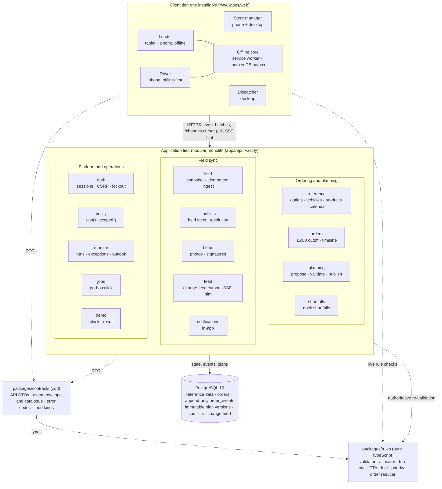

# Architecture

NextDrop is one installable web app (PWA) with four role shells, over one modular-monolith API and one PostgreSQL database. The design source is `agent-docs/spec/overview.md`. This page is the submission summary.

## Containers and components

`docker-compose.yml` runs one `app` container beside a `db` container (`postgres:16`). The app container applies migrations, seeds, and serves the API and the built PWA from one origin (`@fastify/static`, with client-side routes falling back to `index.html`). The `public` profile adds Caddy in front for TLS. The public URL, https://nextdrop.duckdns.org, runs this same stack on one DigitalOcean droplet (ADR 0051, `agent-docs/spec/platform/deployment.md`). A `solver` profile is only a placeholder: the optional solver sidecar is not built (ADR 0014).

## How the parts fit

| Concern | Approach |
| --- | --- |
| Rules | Written once in `packages/rules`. The browser bundles it for instant feedback while the dispatcher edits a plan; the server re-validates every plan before publishing. |
| Order lifecycle | Each order has an append-only event log. Its status is a projection computed by the same pure reducer, in the same transaction. |
| Field work offline | Loader and driver actions are intent events ("delivered 12 crates at 06:12 under plan v3"), queued in an IndexedDB outbox and ingested idempotently. |
| Clashes | Detected by plan version, never by device clock. A human resolves every true clash in the dispatcher's exceptions inbox. |
| Change delivery | A monotonic change feed with cursors is the source of truth. SSE only hints that something changed, with polling as the fallback. |
| Time | The server owns time (with a demo clock override). Instants are stored in UTC and shown in Asia/Colombo. |

## Dependency rules

From `agent-docs/spec/platform/stack-and-layout.md` §3.3:

- `packages/rules` imports nothing from the repo and has no runtime dependencies.
- `packages/contracts` may import types and shared constants from `rules`, and nothing else in the repo.
- `apps/web` and `apps/api` may import `rules` and `contracts`, and never each other. `apps/web` never imports Prisma.
- Inside `apps/api`, modules talk only through each module's `index.ts`. Prisma models never cross the HTTP boundary; DTOs from `contracts` do.

dependency-cruiser enforces these rules (`pnpm deps:check`, `.dependency-cruiser.js`) in CI and in the pre-push hook, including web importing api and deep imports between API modules.

## Build status

As of 4 Oct 2026, 22:50 (`main` at `8d49e6b`). "Built" means merged to `main`. **TODO (before submission):** refresh this table if more merges land.

| Part | Status |
| --- | --- |
| `packages/rules`: calendar, units, cutoff, trip time, ETA, fuel, validator, ranking, allocator, order reducer | Built, with unit and property tests |
| `packages/contracts`: event envelope and catalogue, API DTOs, route table | Built (v1; `LOAD_DAMAGED` is v2 with an upcaster, #114) |
| Database: Prisma schema, two migrations (the first with hand-written SQL), readiness check | Built |
| Seed: reference data, seeded accounts, the Peliyagoda peak day, the Kandy story fixtures | Built (#30) |
| API: server, `/api/healthz`, `/api/readyz` | Built |
| API: auth (login, sessions, CSRF, lockout) and policy (`can()`, `scoped()`), with authorization matrix tests | Built (#35, #58) |
| API: store orders (cutoff, place, track, cancel, receipt, issues) and reference data | Built (#42, #110) |
| API: planning (day, propose, draft, validate, fleet), publish and plan versions, dock shortfalls | Built (#45, #48, #51) |
| API: change feed, SSE hint and notifications | Built (#41) |
| API: field snapshot, sync ingest, heartbeat and blob upload | Built (#47, #50). `TRIP_READY` is refused until every Loader checklist line is checked (#115) |
| API: sync conflicts (classification, held facts, resolution, outcomes for field devices) | Built (#54, #97, #117) |
| API: run monitor, exceptions inbox, dispute resolution and capacity outlook | Built (#59, #55) |
| API: server clock, planning-day tick and demo reset | Built (#38). Presets `before-cutoff` and `orders-closed` are built; the other presets and the demo panel are planned (#56) |
| Web: routes, login and the four role shells | Built (#36) |
| Web: shared component kit | Built (#39) |
| Web: offline core (IndexedDB storage, outbox, sync, session recovery) | Built (#40) |
| Web: Store app (place order, my deliveries, tracking, timeline, receipt, issues, history, notifications) | Built (#43, #44) |
| Web: Dispatcher app (dashboard, order queue, plan board, deferral review and publish, delivery progress and exceptions inbox, capacity outlook) | Built (#46, #49, #61, #55) |
| Web: Loader app (dock trips, load checklist, short and damaged lines, hand-over, offline) | Built (#52) |
| Web: Driver app (today's run, stop and proof of delivery, offline switch, clash cards, recovery) | Built (#53) |
| Web: Sinhala and Tamil field strings | Drafts only, not yet checked by a native speaker ([field-locale-drafts.md](field-locale-drafts.md), #57) |
| Story fixture picker (`pnpm seed:pick-fixtures`) | Built |
| Docker Compose, Dockerfile, `.env.example` | Built (#31) |
| CI: typecheck, lint, boundaries, unit and integration tests, build, `docker compose up` smoke, Playwright | Built (#26, #87, #62) |
| Playwright walkthrough test (14 steps) | Built (#62), running in CI against the Compose stack, plus a manual `e2e-public` workflow against a deployed URL. Steps 1 to 6 and 8 to 14 pass. Step 7 is `test.fixme`: the Loader asks to accept a plan only when a changed plan arrives, so the first plan cannot be "accepted" as the step words it. Step 8 loads the truck as a stand-in |
| Other Playwright suites: accessibility (axe), field locales, repeat deferral, Driver offline switch | Built |
| Public deployment | Built: https://nextdrop.duckdns.org on a DigitalOcean droplet (#33, #67, ADR 0051) |
| Fleet screen and vehicle breakdowns | Not built (#63) |
| Load reversal for loaded orders | Not built (#60) |
| Web Push notifications (optional) | Not built (#65). Notifications are in-app only (ADR 0013) |
