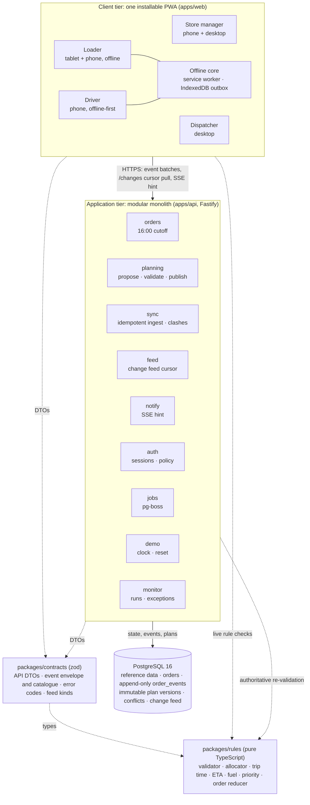

# Architecture

NextDrop is one installable web app (PWA) with four role shells, over one modular-monolith API and one PostgreSQL database. The design source is `agent-docs/spec/overview.md`. This page is the submission summary.

## Containers and components

In production, one `app` container runs the API and serves the built PWA from the same origin, beside a `db` container (`postgres:16`). An optional `caddy` profile adds TLS for the public deployment. **TODO (#31, #33):** confirm these against the merged Compose file and the chosen host.

## How the parts fit

| Concern | Approach |
| --- | --- |
| Rules | Written once in `packages/rules`. The browser bundles it for instant feedback while the dispatcher edits a plan; the server re-validates every plan before publishing. |
| Order lifecycle | Each order has an append-only event log. Its status is a projection computed by the same pure reducer, in the same transaction. |
| Field work offline | Loader and driver actions are intent events ("delivered 12 crates at 06:12 under plan v3"), queued in an IndexedDB outbox and ingested idempotently. |
| Clashes | Detected by plan version, never by device clock. A human resolves every true clash in the dispatcher's exceptions inbox. |
| Change delivery | A monotonic change feed with cursors is the source of truth. SSE only hints that something changed, with polling as the fallback. |
| Time | The server owns time (with a demo clock override). Instants are stored in UTC and shown in Asia/Colombo. |

## Dependency rules

From `agent-docs/spec/platform/stack-and-layout.md` §3.3:

- `packages/rules` imports nothing from the repo and has no runtime dependencies.
- `packages/contracts` may import types from `rules`.
- `apps/web` and `apps/api` may import `rules` and `contracts`, and never each other. `apps/web` never imports Prisma.
- Inside `apps/api`, modules talk only through each module's `index.ts`. Prisma models never cross the HTTP boundary; DTOs from `contracts` do.

**TODO (#26):** once it merges, note that CI enforces these rules with dependency-cruiser.

## Build status

As of 3 Oct 2026. **TODO (before submission):** refresh this table.

| Part | Status |
| --- | --- |
| `packages/rules`: calendar, units, cutoff, trip time, ETA, fuel, validator, ranking, allocator, order reducer | Built, with unit and property tests |
| `packages/contracts`: event envelope and catalogue, API DTOs, route table | Built (v1) |
| Database: Prisma schema, first migration with hand-written SQL, readiness check | Built |
| API: server, `/api/healthz`, `/api/readyz` | Built |
| API: auth (login, sessions, CSRF, lockout) and policy (`can()`, `scoped()`) | Built (#35) |
| Story fixture picker (`pnpm seed:pick-fixtures`) | Built |
| Web: routes, login and the four role shells | In progress (#36) |
| API modules: orders, planning, sync, feed, notify, demo, monitor | Planned (#38, #41, #42, #45, #47, #48, #54, #59) |
| Offline core, Loader and Driver apps | Planned (#40, #52, #53) |
| Seed, Docker Compose, public deployment | Planned (#30, #31, #33) |
