# Data model

How NextDrop stores and connects its data. The schema is `apps/api/prisma/schema.prisma` (PostgreSQL 16, Prisma 7), and `agent-docs/spec/data/model.md` describes every model. The diagram below shows every table and every foreign key, with each table's keys and a few identifying columns. It was regenerated with `pnpm docs:erd` against the schema on `main` (4 Oct 2026): 31 models, 43 foreign keys.

## Model groups

| Group | Tables | Notes |
| --- | --- | --- |
| Reference | `Outlet`, `Vehicle`, `District`, `ServiceAllowance`, `CalendarDay`, `TrafficSpeed`, `RoadCondition`, `Product`, `Driver` | Seeded from `data/reference/*.csv` and read-only at runtime. `Product` is a synthetic catalogue. Traffic and road conditions affect only displayed ETAs and risk, never plan validity. |
| Identity | `User`, `Session`, `Device` | Four login roles. Field sessions are bound to a device. |
| Orders | `Order`, `OrderLine`, `OrderEvent`, `OutletServiceState` | `OrderEvent` is the append-only timeline every role reads and adds to. `Order.status` is a projection of it. |
| Planning | `PlanningDay`, `PlanDraft`, `PlanVersion`, `PlanVersionChange`, `Trip`, `TripStop`, `Deferral`, `VehicleAvailability` | Drafts use optimistic revisions. Published versions are immutable snapshots. Every deferral stores its reason. |
| Sync | `Conflict`, `Blob`, `ChangeFeed`, `FeedCounter`, `Notification` | Clashes are held for a human. The change feed has gap-free sequence numbers. Proof-of-delivery photos and signatures are stored as blobs. |
| Support | `WeeklyDemandHistory`, `DemoState` | Capacity outlook history and the demo clock and reset epoch. |

## Storage conventions

- Every table has a UUID primary key (UUID v7). Display IDs (`OUT004`, `VEH039`, `ORD10412`) are separate unique columns.
- Foreign keys restrict deletion, so history cannot disappear through cascades.
- Hand-written SQL in the migration adds immutability triggers, CHECK constraints and a partial unique index: an order has at most one active (non-cancelled) trip stop.
- Reference capacities and distances are `Decimal(10,3)` in the CSV units (kg, m³, km, L). Product and order-line unit sizes are `Decimal(13,6)` kg and m³. Order totals (`Order.weightG`, `Order.volumeL`) are integer grams and litres, ceiled once from the exact sum (ADR 0023). `packages/rules` computes only in integers (ADR 0018).
- Window, ETA and departure values are minutes after local midnight. Instants are `timestamptz(3)`; delivery dates are `date`.

## Entity-relationship diagram

Generated by `pnpm docs:erd` (`scripts/docs/erd.mjs`); do not edit the diagram by hand.

```mermaid
erDiagram
  District ||--o{ Outlet : "districtId"
  District ||--o{ TrafficSpeed : "districtId"
  District ||--o{ RoadCondition : "districtId"
  Vehicle ||--o| Driver : "vehicleId"
  Outlet |o--o{ User : "outletId"
  Vehicle |o--o{ User : "vehicleId"
  User ||--o{ Session : "userId"
  Device |o--o{ Session : "deviceId"
  User ||--o{ Device : "userId"
  Outlet ||--o{ Order : "outletId"
  Order |o--o{ Order : "replacesOrderId"
  Order ||--o{ OrderLine : "orderId"
  Product ||--o{ OrderLine : "productId"
  Order |o--o{ OrderEvent : "orderId"
  Trip |o--o{ OrderEvent : "tripId"
  Vehicle |o--o{ OrderEvent : "vehicleId"
  Device |o--o{ OrderEvent : "deviceId"
  User ||--o{ OrderEvent : "actorUserId"
  Outlet ||--o| OutletServiceState : "outletId"
  PlanningDay ||--o| PlanDraft : "planningDayId"
  User ||--o{ PlanDraft : "updatedBy"
  PlanningDay ||--o{ PlanVersion : "planningDayId"
  User ||--o{ PlanVersion : "publishedBy"
  PlanVersion ||--o{ PlanVersionChange : "planVersionId"
  Order ||--o{ PlanVersionChange : "orderId"
  Trip |o--o{ PlanVersionChange : "tripId"
  PlanningDay ||--o{ Trip : "planningDayId"
  Vehicle ||--o{ Trip : "vehicleId"
  District ||--o{ Trip : "districtId"
  Trip ||--o{ TripStop : "tripId, tripStatus"
  Order ||--o{ TripStop : "orderId"
  Order ||--o{ Deferral : "orderId"
  PlanningDay ||--o{ Deferral : "planningDayId"
  Vehicle ||--o{ VehicleAvailability : "vehicleId"
  User ||--o{ VehicleAvailability : "setBy"
  Order |o--o{ Conflict : "orderId"
  Trip |o--o{ Conflict : "tripId"
  OrderEvent ||--o| Conflict : "heldEventId"
  User ||--o{ Conflict : "openedBy"
  User |o--o{ Conflict : "resolvedBy"
  OrderEvent |o--o{ Blob : "ownerEventId"
  User |o--o{ Notification : "userId"
  User |o--o{ DemoState : "lastResetBy"
  Outlet {
    String id PK
    String displayId UK
    String depot
    String districtId FK
  }
  Vehicle {
    String id PK
    String displayId UK
    String depot
  }
  District {
    String id PK
    String name UK
    String depot
  }
  ServiceAllowance {
    String id PK
  }
  CalendarDay {
    String id PK
    DateTime date UK
  }
  TrafficSpeed {
    String id PK
    String districtId FK
  }
  RoadCondition {
    String id PK
    DateTime date
    String districtId FK
  }
  Product {
    String id PK
    String sku UK
    String name
  }
  Driver {
    String id PK
    String displayId UK
    String name
    String vehicleId FK, UK
  }
  User {
    String id PK
    String loginId UK
    Role role
    String depot
    String outletId FK
    String vehicleId FK
  }
  Session {
    String id PK
    SessionKind kind
    String userId FK
    String deviceId FK
  }
  Device {
    String id PK
    SessionKind kind
    String userId FK
  }
  Order {
    String id PK
    String displayId UK
    OrderStatus status
    String idempotencyKey UK
    String outletId FK
    String replacesOrderId FK
  }
  OrderLine {
    String id PK
    String orderId FK
    String productId FK
  }
  OrderEvent {
    String id PK
    String clientEventId UK
    String orderId FK
    String tripId FK
    String vehicleId FK
    String deviceId FK
    String actorUserId FK
  }
  OutletServiceState {
    String id PK
    String outletId FK, UK
  }
  PlanningDay {
    String id PK
    String depot
    DateTime date
    PlanningDayState state
  }
  PlanDraft {
    String id PK
    Int revision
    String planningDayId FK, UK
    String updatedBy FK
  }
  PlanVersion {
    String id PK
    Int version
    String planningDayId FK
    String publishedBy FK
  }
  PlanVersionChange {
    String id PK
    String planVersionId FK
    String orderId FK
    String tripId FK
  }
  Trip {
    String id PK
    String displayId UK
    TripStatus status
    String planningDayId FK
    String vehicleId FK
    String districtId FK
  }
  TripStop {
    String id PK
    String tripId FK
    TripStatus tripStatus FK
    Int seq
    String orderId FK
  }
  Deferral {
    String id PK
    String orderId FK
    String planningDayId FK
  }
  VehicleAvailability {
    String id PK
    DateTime date
    AvailabilityStatus status
    String vehicleId FK
    String setBy FK
  }
  Conflict {
    String id PK
    String kind
    ConflictState state
    String orderId FK
    String tripId FK
    String heldEventId FK, UK
    String openedBy FK
    String resolvedBy FK
  }
  Blob {
    String id PK
    String clientBlobId UK
    String ownerEventId FK
  }
  ChangeFeed {
    String id PK
    BigInt seq UK
    String kind
    Int version
    String depot
  }
  FeedCounter {
    String id PK
    Boolean singleton UK
  }
  Notification {
    String id PK
    Role role
    String depot
    String kind
    String userId FK
  }
  WeeklyDemandHistory {
    String id PK
    String depot
  }
  DemoState {
    String id PK
    Boolean singleton UK
    String lastResetBy FK
  }
```

<!-- erd:start -->

<!-- erd:end -->
